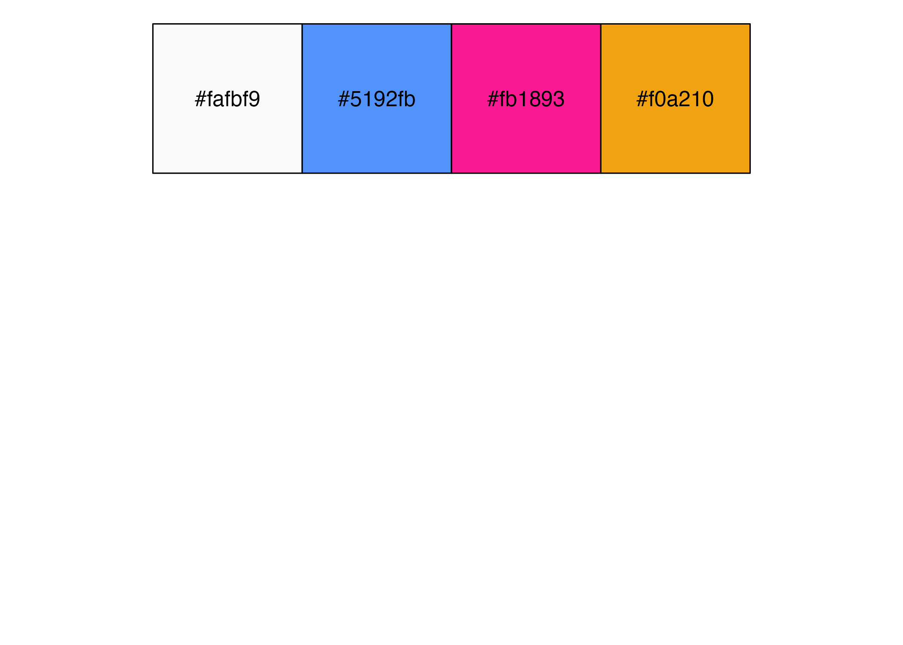

# 次の一歩を踏み出すためのtidyverse入門

2023年8月27日開催

統計数理研究所 統計思考院
オンラインワークショップ「[**探索的ビッグデータ解析と再現可能研究**](https://sites.google.com/view/ws-ebda-rr-2023/)」


## 要旨

tidyverseはR言語でのデータ分析を行う際に便利なパッケージの集まりである。
統一された設計思想のもと、データ操作（dplyr、tidyr）、ファイルの読み書き（readr）、可視化（ggplot2）などのパッケージを提供している。2016年の登場から度重なるアップデートを経て、成熟期を迎えている。
国内外でtidyverseや関係するパッケージの解説が豊富に存在するが、Rでの関数型プログラミングを補助するpurrrパッケージなど、他と比べて焦点を当てられる機会が少ないパッケージ・関数も存在する。本講演ではtidyverseのさらなる活用を目指す人を対象に、これらの使い方を解説するとともに、より効率的に作業を進めるためのノウハウを伝授する。

## カラーテーマ

``` r
pals <- 
  c("#fafbf9", "#5192fb", "#fb1893", "#f0a210")
scales::show_col(pals, ncol = 4)
```


